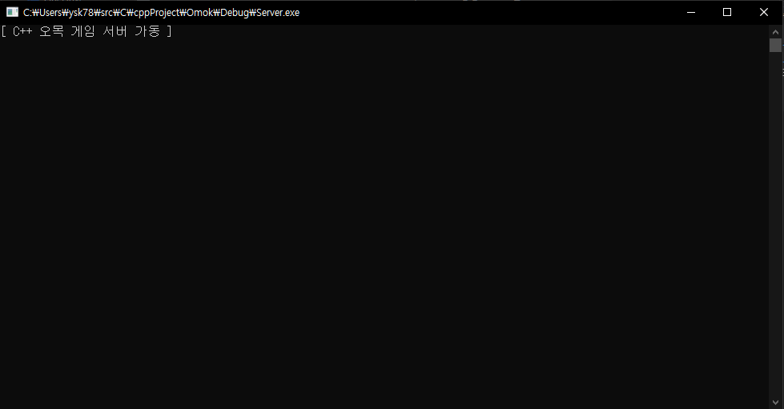
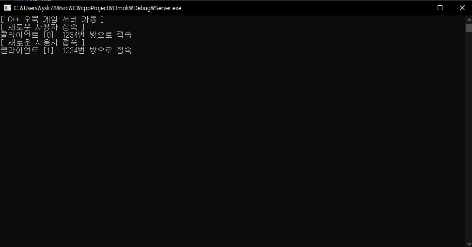
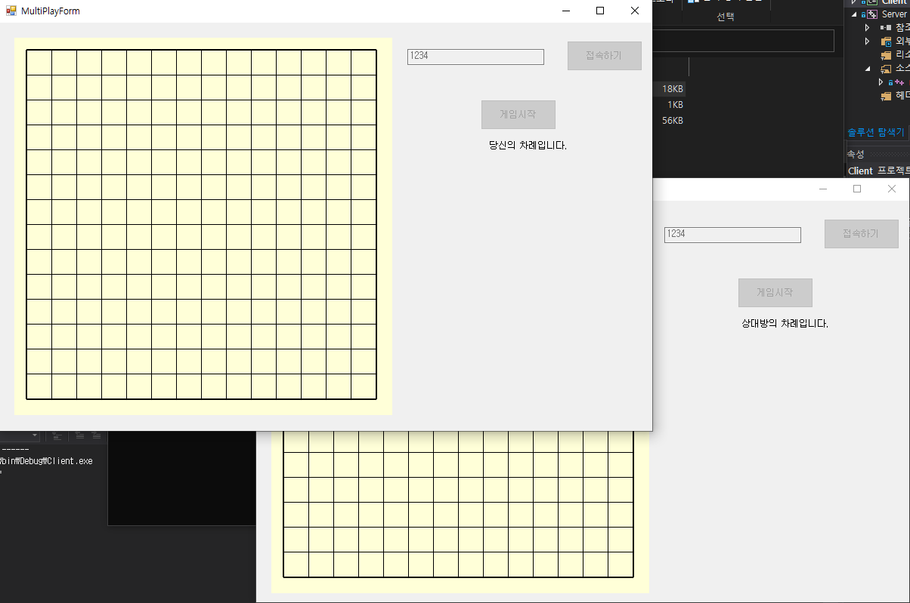
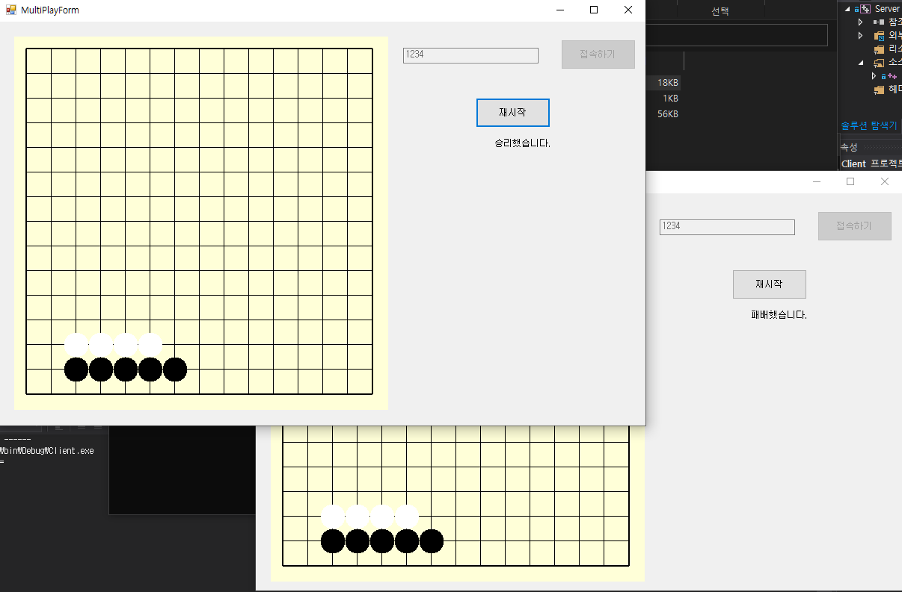

# C++\_Projects

C++ projects(Socket Communication, Games)

## 1. TCP Echo Socket Communication Program

## 2. Omok Game

- Single Play

### - Start menu

### - Single Play Button Clicked

### - Game Over

### - Cannot click board when playing is done

- Multi Play

### - Server Started

### - Two clients connected to same room

### - Multiplay started

### - Game over

